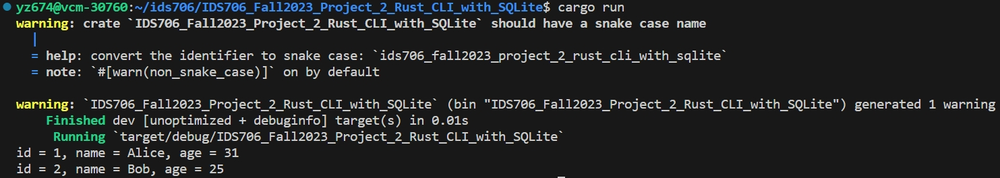
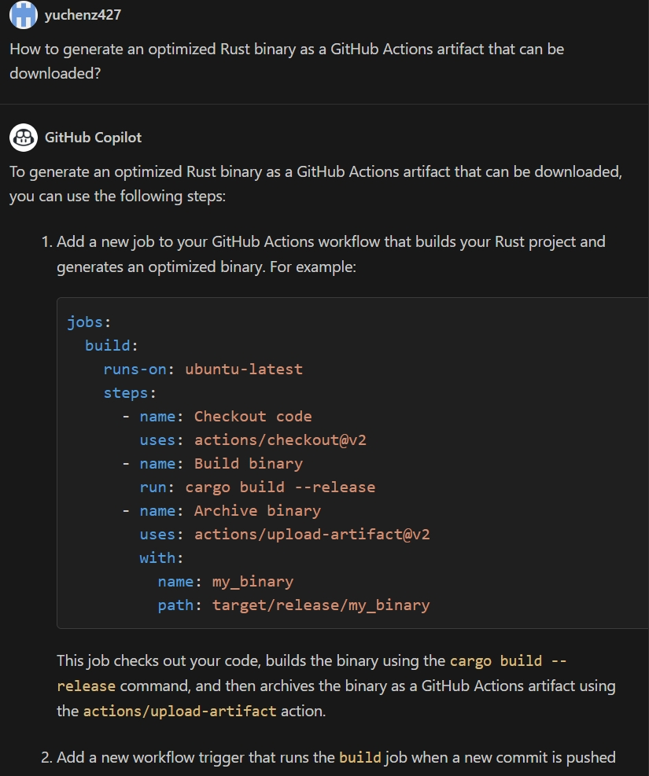

[](https://github.com/nogibjj/IDS706_Fall2023_Project_2_Rust_CLI_with_SQLite/actions/workflows/install.yml)
[](https://github.com/nogibjj/IDS706_Fall2023_Project_2_Rust_CLI_with_SQLite/actions/workflows/lint.yml)
[](https://github.com/nogibjj/IDS706_Fall2023_Project_2_Rust_CLI_with_SQLite/actions/workflows/format.yml)
[](https://github.com/nogibjj/IDS706_Fall2023_Project_2_Rust_CLI_with_SQLite/actions/workflows/test.yml)
# IDS706_Fall2023_Project_2_Rust_CLI_with_SQLite

Fall 2023 IDS_706 Data Engineering Systems Individual Project 2: Rust CLI with SQLite

### Demo Video On Youtube: 

The project contains:

- ``Cargo.toml``: the configuraion file used by the Rust package manager, defines the dependencies of the whole project

- ``./src/main.rs``: the Rust source code that demonstrates CRUD operations on the SQLite database

- ``./tests/test_main.rs``: the Rust unit test code that tests the functionality of ``main.rs``

- ``Makefile``: defines `install` `format` `lint` `test` actions according to the project requirements

- ``.github/github-actions.yml``: defines the github action job that builds and downloads the ``optimized Rust binary artifact``

## How to run the program
First run 
```bash
make all
```
to run the whole install lint format test pipeline for the rust project. Then run
```bash
cargo run
```
to run the ``main.rs`` code. It should perform the following database operations:<br>
- Create a table called ``people``
- Insert two records: ``(Alice, 30)`` and ``(Bob, 25)``
- Update one of the records to ``(Alice, 31)``
- Read all data and print the records to ``stdout``
- Delete ``Bob``'s record
<br>
It should print out the records like this:<br>



To run the unit test, simply run
```bash
cargo test
```
which runs ``./tests/test_main.rs`` and verifies the functionality of ``./src/main.rs``. 

## Dependencies and how to install them
This project depends on ``rusqlite`` to interact with ``SQLite`` database. The dependency is defined in ``Cargo.toml``; to install, simply run 
```bash
cargo build
```

## Usage of Github Copilot
As a true beginner of Rust, I found Github Copilot extremely useful in this project. For example, I have totally no idea about how to generate and download an optimized Rust binary for the project, and the problem was directly addressed by Copilot Chat:<br>
